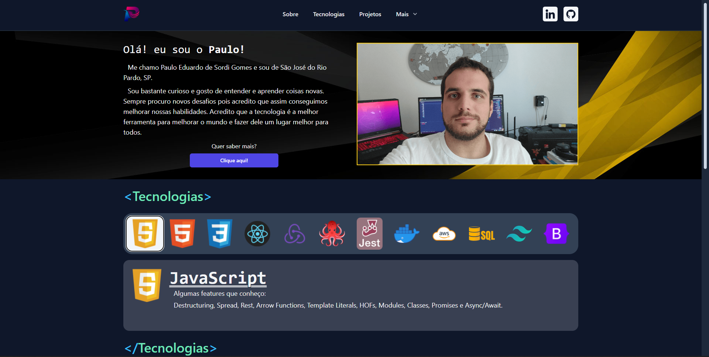

<h1 align="center">Meu portfólio</h1>

Link para a aplicação: https://pauloedsg.com

## Aprendizados
 * Fazer um carousel com tailwind e React
 * Utilizar a biblioteca HeadlessUI
 * Configurar o ambiente de desenvolvimento
 * Configurar o ambiente de produção
 * CI/CD usando GitHub Actions e AWS EC2
 * Docker
 * Nginx

<h2 align="center">Como rodar o projeto</h2>

### No terminal
1. Clonar o projeto `git clone git@github.com:pauloeduardods/pauloeduardods.github.io.git`
2. Entrar no diretório `cd pauloeduardods.github.io`
3. Instalar as dependências `npm install`
4. Rodar a aplicação `npm start`
5. Acessar a aplicação `http://localhost:3000`

### Com docker
1. Clonar o projeto `git clone git@github.com:pauloeduardods/pauloeduardods.github.io.git`
2. Entrar no diretório `cd pauloeduardods.github.io`
3. Rodar o docker build `docker build -t pauloeduardods:latest .`
4. Rodar o docker run `docker run -p 8080:80 -d pauloeduardods`
5. Acessar a aplicação `http://localhost:8080`

### Com docker-compose
1. Clonar o projeto `git clone git@github.com:pauloeduardods/pauloeduardods.github.io.git`
2. Entrar no diretório `cd pauloeduardods.github.io`
3. Rodar o docker-compose `docker-compose up`
4. Acessar a aplicação `http://localhost:8080`

## Tecnologias
* React
* Tailwind
* Tailwind-Styled-Components
* HeadlessUI
* GitHub Actions (CI/CD)
* AWS EC2 (CD)
* Docker
* Nginx

## Status

🚧 Em desenvolvimento 🚧

 - [x] Desenvolver o header
 - [x] Desenvolver o footer
 - [x] Desenvolver a seção do About
 - [x] Desenvolver a seção de Tecnologias
 - [x] Desenvolver a seção de Projetos
 - [ ] Testar a aplicação
